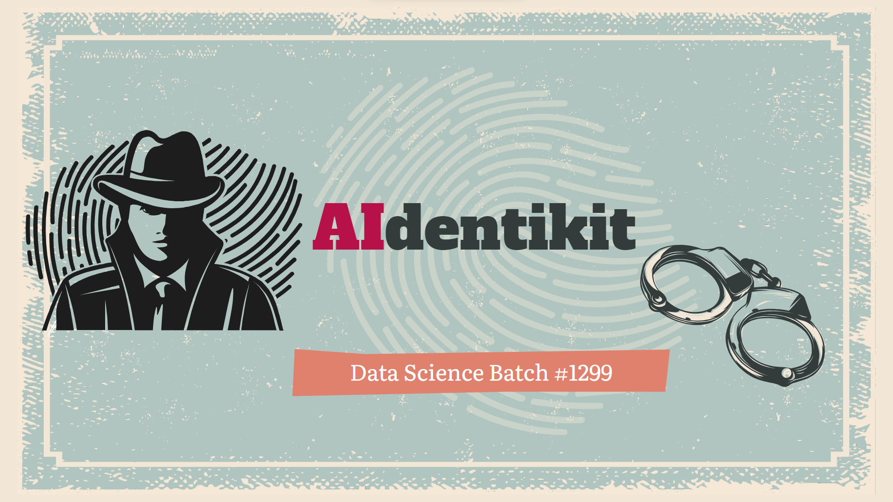
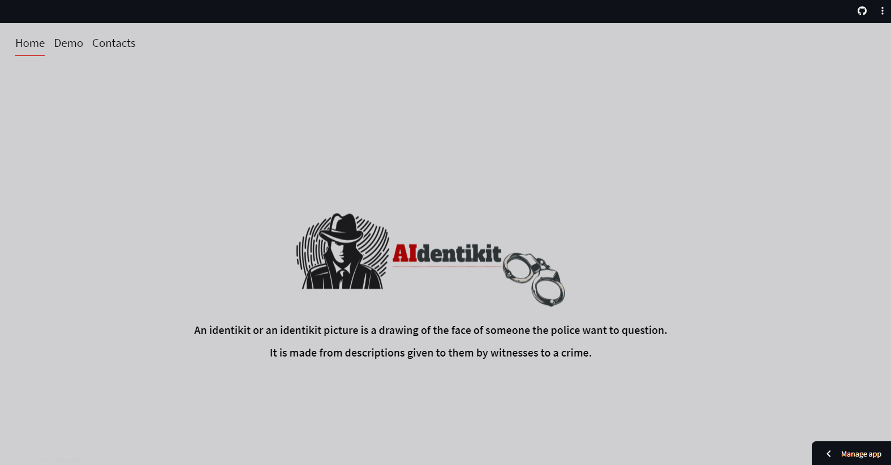
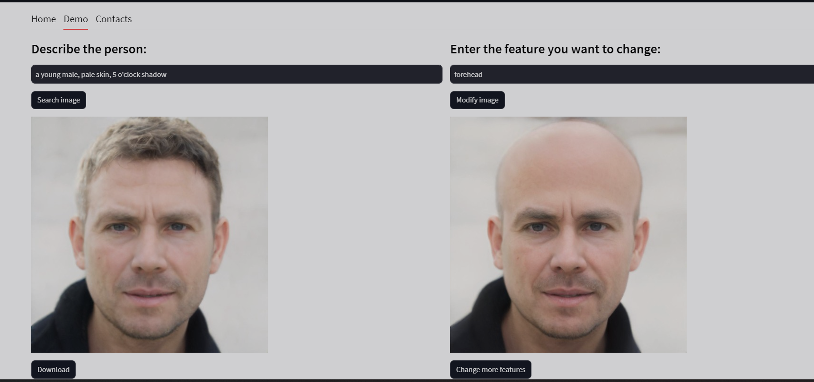

# Readme lat update 2023.Sep.6
# Description of App "AIdentikit"

# setup command 
## install in development mode
pip install -e .
## install in production mode
pip install .

# run command
python main.py

# To modify input text
## you need to modify "input text" in "process.py"

# To see the selected pictures 
## goto data/save/ directory

### lastupdated 2023 Aug 30
- 2023 Aug 30: added a vocaburary dict option in Tfidifvectorization
-            : changed ngram_range(1,2) --> (1,3)
